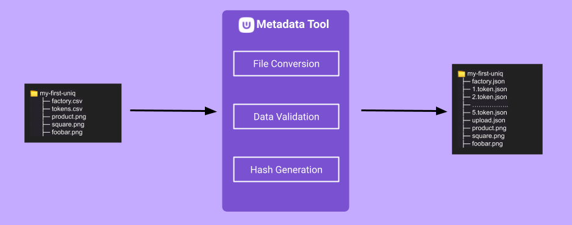

# Metadata Tool

- [Metadata Tool](#metadata-tool)
  - [Overview](#overview)
  - [Obtaining the tool](#obtaining-the-tool)
    - [Downloading a release:](#downloading-a-release)
    - [Building a binary/executable:](#building-a-binaryexecutable)
  - [Configuration file](#configuration-file)
  - [How to use](#how-to-use)
    - [Setup Folder Structure:](#setup-folder-structure)
    - [Setup CSV Template:](#setup-csv-template)
    - [Image/Media Pathing:](#imagemedia-pathing)
    - [Supported Media Types:](#supported-media-types)
    - [Running the tool:](#running-the-tool)
    - [Output file structure:](#output-file-structure)
  - [License](#license)

---

## Overview

The metadata tool simplifies the process for creating complicated token factories and associating tokens with those factories. This tool allows the user to specify token factory specifications and corresponding token(s) specifications in an easy to use CSV template.

This tool takes CSVs and media files (Uniq images, videos and other supported media files) as input, converts to files to JSON objects, validates the JSON data, generates `sha256` hashes of the JSON objects and outputs the generated JSON files.

<p align="center">
  
</p>

**Note that the tool itself does not interact with the blockchain; rather, it simplifies the process of creating complicated token factories and the associated tokens.**

---

## Obtaining the tool

There are two ways of obtaining the tool:

### Downloading a release:

1. You can download the latest release of the tool from [here](add-release-link-here).
2. **[Optional]** Create a `config.json` file in the same directory as your binary/executable. Refer to [Configuration file](#configuration-file) section for more info on the config file.

### Building a binary/executable:

You can manually build the binary/executable of the tool by cloning the repository on your system and following these steps:

1. Install dependencies using `npm i`.
2. **[Optional]** Create `config.json` file in the root directory of your repository. Refer to [Configuration file](#configuration-file) section for more info on the config file.
3. Build the package using `npm run build` and it will generate the releases under `/releases` directory.
4. Run the generated binary using: `./releases/metadata-tool-vX-Y-Z-linux `

---

## Configuration file

The configuration file (`config.json`) is a JSON object that allows user to map environment names to their corresponding base URIs. Each environment corresponds to a specific environment in which the metadata and media file for token factory and associated token(s) are to be be hosted/uploaded.

Here's an example of what the config file _might_ look like:

```json
{
    "production": "https://www.my-nft-website.com",
    "staging": "https://staging.my-nft-website.com",
    "mys3bucket": "https://s3.us-east-1.foobar.com",
    "custom": "https://www.my-custom-env.com"
}
```

In the example above, the `production`, `staging`, `mys3bucket` and `custom` environments are mapped to their corresponding base URIs. When the tool is run, it will read the config file and will prompt the user to select either one of the provided environments. The corresponding URI for the selected environment will be used as base URI for the generated factory and token(s).

Note that the environments and base URIs in the config file shown above are just examples, and you should replace them with the actual environment(s) for your use-case.

**Note**: If you do not provide a config file, the tool will prompt you to enter a base URI.

---

## How to use

Once you have obtained the tool, next step is to setup the folder structure along with the media files and adding data to the CSV template.

However there are a few things to note.

-   A report is always generated during runtime.
-   However, reports are not generated until you close the program.
-   Reports will help you debug your CSV files, any missing information will be posted to the report and sometimes in the terminal / console window.

### Setup Folder Structure:

It is recommended to use the following folder setup for ease of use.

```
MyFirstUniq/ 📁 (This is your Root Folder)
|- factory.csv
|- tokens.csv
|
|- factory/ 📁
|   |- sq.png
|   |- product.png
|   |- gallery/ 📁
|       |- 1.png
|
|- tokens/ 📁
    |- 1 📁
    |   |- image.png
    |   |- gallery/ 📁
    |       |- 1.png
    |
    |- 2 📁
    |   |- image.png
    |   |- gallery/ 📁
    |       |- 1.png
```

However, the folder structure can be modified and replaced with a single folder that contains CSV files and relevant images/media files.

### Setup CSV Template:

1.  Use the following CSV template: [Google Sheets Metadata Tool Template](https://docs.google.com/spreadsheets/d/1Gi0iuJis-riKkyhYgMRYVnhGD6PbjvBv8U7lhRwdhNk/edit?usp=sharing) (Visit the link and go to `File -> Make a Copy` to make a copy in your own Google Drive).
2.  Open your copied CSV template in your Google Drive and begin modifications of individual fields. (Read the first sheet for information regarding the template).
3.  Export both `factory` and `tokens` sheets as CSV files. `File -> Download -> csv`
4.  Rename factory file to `factory.json` and place in your root folder. (See [Folder Structure](#folder-structure) Above)
5.  Rename token file to `tokens.json` and place in your root folder.

### Image/Media Pathing:

There are two ways to link to an image/media file in your CSV file. One is relative path, and the other is an external HTTP or HTTPS address.

-   Relative Path: `./tokens/1/image.png` (Relative to your root folder)
-   External: `https://some-external-website.com/tokens/1/image.png`

### Supported Media Types:

The tool currently only supports the follow media types:

-   jpg / jpeg
-   png
-   bmp
-   gif
-   webp
-   mp4
-   webm
-   json

### Running the tool:

Once the CSV files and all related images/media files are present in the folder, you can process the folder for JSON creation.

1. Drag & Drop the Folder onto the Executable

    a. Watch the console window for errors.

    b. If errors have occurred, you can check the report generated after closing the application

2. If there are no errors, a `upload.json` file will be generated in your root folder.

### Output file structure:

The `upload.json` file contains all metadata (collection name, factory/token hashes & URLs, media URLs) for your Uniq collection. A sample output file _might_ look like this:

(This example is based on the sample folder structure provided above.)

```json
{
    "collectionName": "MyFirstUniq",
    "factory": {
        "hash": "<sha256-of-factory.json>",
        "url": "https://www.my-nft-website.com/MyFirstUniq/<sha256-of-factory.json>.json"
    },
    "defaultToken": {
        "hash": "<sha256-of-defaultToken.json>",
        "url": "https://www.my-nft-website.com/MyFirstUniq/{serial_number}.json"
    },
    "tokens": [
        {
            "serialNumber": "1",
            "hash": "<sha256-of-1.token.json>",
            "url": "https://www.my-nft-website.com/MyFirstUniq/1.json"
        },
        {
            "serialNumber": "2",
            "hash": "<sha256-of-2.token.json>",
            "url": "https://www.my-nft-website.com/MyFirstUniq/2.json"
        }
    ],
    "media": {
        "factory/sq.png": "https://www.my-nft-website.com/MyFirstUniq/<hash-of-file>.png",
        "factory/product.png": "https://www.my-nft-website.com/MyFirstUniq/<hash-of-file>.png",
        "factory/gallery/1.png": "https://www.my-nft-website.com/MyFirstUniq/<hash-of-file>.png",
        "tokens/1/image.png": "https://www.my-nft-website.com/MyFirstUniq/<hash-of-file>.png",
        "tokens/1/gallery/1.png": "https://www.my-nft-website.com/MyFirstUniq/<hash-of-file>.png",
        "tokens/2/image.png": "https://www.my-nft-website.com/MyFirstUniq/<hash-of-file>.png",
        "tokens/2/gallery/1.png": "https://www.my-nft-website.com/MyFirstUniq/<hash-of-file>.png"
    },
    "environment": {
        "env": "production",
        "url": "https://www.my-nft-website.com"
    }
}
```

Note that the URLs provided in the output file are based on the environment URIs that were provided to the program. These URLs are where your Uniq metadata files _should_ be hosted/uploaded.

---

## License

TODO
